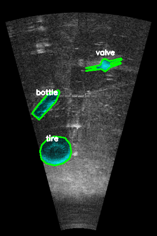

# Dataset Description
    The dataset consists of images obtained from a forward looking SONAR and the corresponding semantic labels for 11 classes (except background)

## IMAGES
* The images (marine-debris-fls-datasets/md_fls_dataset/data/watertank-segmentation/Images) are taken from [Water Tank Marine Debris with ARIS Explorer 3000](https://github.com/mvaldenegro/marine-debris-fls-datasets/releases/tag/watertank-v1.0)
* For performing semantic segmentation, the images are resized to standard resolution of 320 x 480.

## LABELS
* The images are labelled for 11 classes (except background). LabelMe is used to generate the semantic labels
* The labels (marine-debris-fls-datasets/md_fls_dataset/data/watertank-segmentation/Labels) are .png files with pixel values determining the labels
* Class names and the corresponding pixel values in the labels are as follows-:
> Pixel Value: Class Name
>>        0:  Background         
>>        1:  Bottle         
>>        2:  Can            
>>        3:  Chain          
>>        4:  Drink-carton   
>>        5:  Hook           
>>        6:  Propeller      
>>        7:  Shampoo-bottle 
>>        8:  Standing-bottle
>>        9:  Tire           
>>        10: Valve         
>>        11: Wall   

* Sample image with labels is as shown -: 